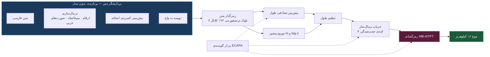
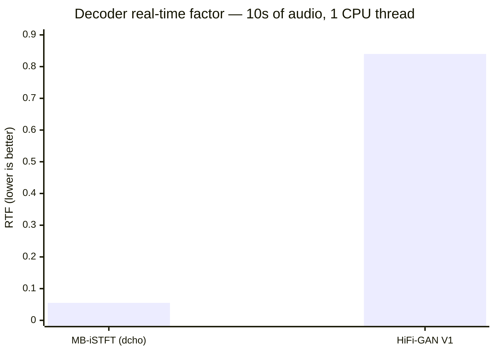
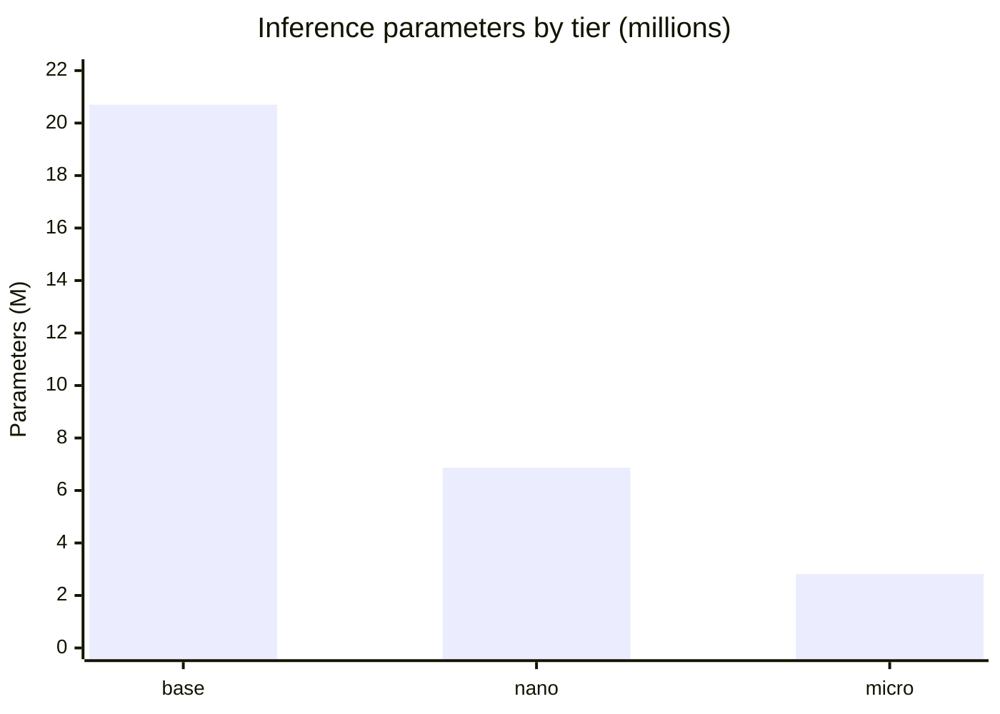
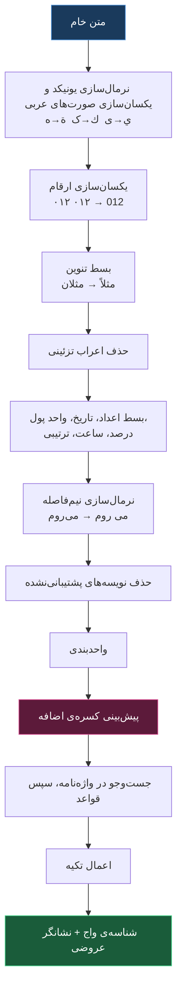
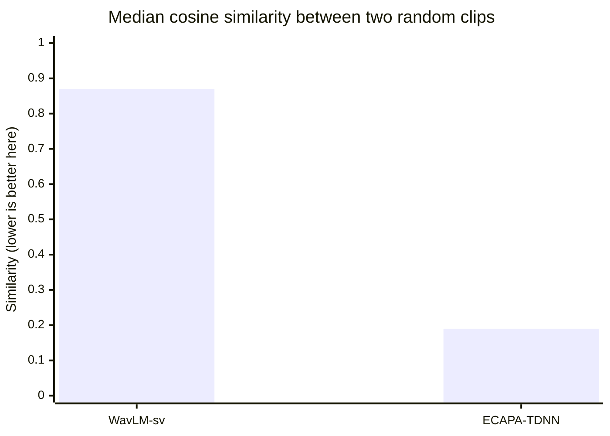

<div align="center">


# dcho

**تبدیل متن به گفتار فارسی، ساخته‌شده برای اجرای بی‌درنگ روی پردازنده**

[](LICENSE)
[](pyproject.toml)
[](tests/)
[](#پیکرهی-داده)

[English](README.md) · **فارسی**

</div>

---

> **وضعیت: پیش از آموزش.** مدل، پردازشگر متن فارسی، خط لوله‌ی داده و حلقه‌ی آموزش پیاده‌سازی و راستی‌آزمایی شده‌اند. پیکره ممیزی و آماده شده است. **هنوز هیچ چک‌پوینت آموزش‌دیده‌ای وجود ندارد.**
> هر عددی در این سند اندازه‌گیری شده است، نه تخمین‌زده — ولی این اعداد درباره‌ی معماری و داده‌اند، نه درباره‌ی کیفیت گفتار، که تا پیش از اجرای آموزش قابل گزارش نیست.

---

## فهرست

- [ایده‌ی حاکم](#ایدهی-حاکم)
- [معماری](#معماری)
- [عملکرد اندازه‌گیری‌شده](#عملکرد-اندازهگیریشده)
- [پردازشگر متن فارسی](#پردازشگر-متن-فارسی)
- [پیکره‌ی داده](#پیکرهی-داده)
- [کشف گوینده](#کشف-گوینده)
- [مهندسی هزینه](#مهندسی-هزینه)
- [ساختار پروژه](#ساختار-پروژه)
- [استفاده](#استفاده)
- [نقشه‌ی راه](#نقشهی-راه)
- [مجوز و ارجاع](#مجوز-و-ارجاع)

---

## ایده‌ی حاکم

یک گزاره شکل‌دهنده‌ی تمام تصمیم‌های این پروژه است:

> **در تبدیل متن به گفتار فارسی، کیفیت خروجی به‌مراتب بیشتر از آنکه به اندازه‌ی مدل صوتی وابسته باشد، به کیفیت داده و درستی پردازشگر متن وابسته است.**

استدلالش ساده است. مدل صوتی وظیفه‌ی محدودی دارد: دنباله‌ای از واج‌ها را به موج صوتی تبدیل کند. اگر دنباله‌ی ورودی غلط باشد — اگر «کرم» در جایی که معنای جمله «کَرَم» است «کِرم» خوانده شود، یا کسره‌ی اضافه در «کتابِ من» حذف شود — هیچ مقدار افزایش پارامتر آن را جبران نمی‌کند. مدل با وفاداری کامل، چیز غلطی را ادا می‌کند.

سه پیامد از این نتیجه می‌شود و همان‌ها ستون فقرات این مخزن‌اند.

**بودجه به پردازشگر متن و تمیزکاری داده تعلق دارد، نه به بزرگ‌تر کردن مدل.** هر دو تقریباً رایگان‌اند، چون هر دو روی پردازنده اجرا می‌شوند.

**اجرا روی پردازنده تقریباً هیچ هزینه‌ای بر کیفیت تحمیل نمی‌کند.** آنچه مدل را روی پردازنده کند می‌کند — زنجیره‌ی کانولوشن ترانهاده در وکودر — همان چیزی نیست که کیفیت را می‌سازد. با جایگزینی آن با تبدیل فوریه‌ی معکوس، تقریباً تمام کیفیت باقی می‌ماند. این ادعا در ادامه اندازه‌گیری شده است: **۱۵.۲۵ برابر سریع‌تر، ۳.۹۳ برابر کوچک‌تر.**

**بیشتر تکرارهای پرهزینه‌ی آموزش، از باگ‌هایی می‌آیند که پردازنده در چند ثانیه پیدایشان می‌کند.** واج‌نگاری غلط، متن ناهم‌خوان، پیکربندی اشتباه. هیچ‌کدام برای کشف شدن به یک اجرای کامل نیاز ندارند. ساختن آشکارسازهای ارزان پیش از هر چیز، همان کاری است که هزینه‌ی کل پروژه را در محدوده‌ی صدها دلار نگه می‌دارد، نه هزاران دلار.

---

## معماری

`dcho` یک مدل تک‌مرحله‌ای و غیرخودبازگشتی است: یک خودرمزگذار وردشی شرطی که توزیع پیشین آن از طریق یک جریان نرمال‌ساز به واج‌ها شرطی می‌شود، به‌همراه رمزگشای iSTFT چندباندی و آموزش خصمانه. از خانواده‌ی VITS2 است، با رمزگشای جایگزین‌شده.

تک‌مرحله‌ای بودن برای کیفیت به‌اندازه‌ی سرعت اهمیت دارد. مدل صوتی و وکودر جدا با اهداف متفاوتی آموزش می‌بینند و در نمایشی میانی به هم می‌رسند که هیچ‌کدام مالکش نیستند؛ ناسازگاری حاصل به‌شکل همان صدای فلزی شنیده می‌شود که سامانه‌های دومرحله‌ای به آن شهره‌اند. اینجا رمزگشا دقیقاً روی همان نمایش نهفته‌ای آموزش می‌بیند که در زمان اجرا دریافت خواهد کرد.



### چرا همه‌چیز به رمزگشا برمی‌گردد

در VITS متعارف، وکودر تنها با کانولوشن‌های ترانهاده به نرخ نمونه‌ی خروجی می‌رسد. در ۱۶ کیلوهرتز با گام پرش ۲۵۶، این یعنی زنجیره‌ی بالابرداری `[8, 8, 2, 2]` — و روی پردازنده این زنجیره بر هر کار دیگری که مدل انجام می‌دهد غلبه دارد.

رمزگشای iSTFT چندباندی فقط ۱۶ برابر در شبکه بالابرداری می‌کند. سپس برای هر یک از چهار زیرباند فرکانسی، دامنه و فاز کوتاه‌زمان را پیش‌بینی می‌کند؛ یک تبدیل فوریه‌ی معکوس آن‌ها را به موج زیرباند تبدیل می‌کند و یک بانک فیلتر شبه‌QMF آن‌ها را ادغام می‌کند. بالابرداری باقی‌مانده با دو عملیات خطی و بدون پارامتر انجام می‌شود، نه با کانولوشن.

```
بالابرداری شبکه‌ای       ۴ × ۴ = ۱۶
گام پرش تبدیل معکوس              ۴
تعداد زیرباندها                  ۴
                        ────────────
مجموع                          ۲۵۶   = گام پرش ✓
```

این اتحاد برای هر پیکربندی در مجموعه‌ی آزمون تصریح شده است، چون اشتباه بودنش صوتی با نرخ غلط تولید می‌کند بدون آنکه هیچ پیام خطایی بدهد.

هر دو مرحله‌ی بدون پارامتر از نظر وفاداری اندازه‌گیری شدند، نه فرض:

| مرحله | خطای بازسازی |
|---|---|
| تحلیل و سنتز PQMF | **منفی ۵۸.۵ دسی‌بل** |
| رفت‌وبرگشت تبدیل فوریه‌ی معکوس | **منفی ۱۴۲ دسی‌بل** (کف دقت float32) |

### اجزا

| جزء | پیکربندی | در زمان اجرا |
|---|---|---|
| رمزگذار متن | ۶ بلوک ترنسفورمر، ۱۹۲ کانال، ۲ سر، موقعیت نسبی | بله |
| پیش‌بین طول | تصادفی، مبتنی بر جریان، با تمایزگر خصمانه | بله |
| جریان نرمال‌ساز | ۴ لایه‌ی جفت‌شدگی، ترنسفورمر در اولی | بله |
| رمزگشا | MB-iSTFT، ۴ زیرباند، n_fft ۱۶، گام ۴ | بله |
| رمزگذار پسین | WaveNet ۱۶ لایه روی طیف‌نگاشت خطی | **خیر** |
| تمایزگرها | چنددوره‌ای (۲،۳،۵،۷،۱۱) + چندتفکیکی + طول | **خیر** |

رمزگذار پسین و تمام تمایزگرها هنگام صادرات حذف می‌شوند. این‌ها حدود یک‌سوم پارامترها و صفر درصد هزینه‌ی اجرا هستند.

آهنگ کلام شایسته‌ی یک یادداشت است. پیش‌بین طولی که برای هر واج یک عدد برمی‌گرداند به میانگین شرطی همگرا می‌شود، و میانگین شرطیِ یک توزیع طول، یکنواختی‌ای است که شنونده بلافاصله ماشینی می‌شنود. پیش‌بین تصادفی، کل توزیع شرطی را با یک جریان نرمال‌ساز می‌آموزد و از آن نمونه می‌گیرد، پس دو واج در بافت یکسان می‌توانند طول متفاوت بگیرند — کاری که گویندگان واقعی می‌کنند.

---

## عملکرد اندازه‌گیری‌شده

همه‌ی اعداد با PyTorch و ممیز شناور ۳۲ بیتی روی پردازنده‌ی x86 اند. انتظار می‌رود ONNX با کوانتیزاسیون گزینشی هشت‌بیتی این‌ها را بهتر کند؛ آن مرحله پیاده‌سازی شده ولی تا وجود یک چک‌پوینت آموزش‌دیده قابل اندازه‌گیری نیست.

### هزینه‌ی رمزگشا، با نرخ خروجی یکسان



| رمزگشا | پارامتر | RTF با ۱ نخ | RTF با ۴ نخ |
|---|---|---|---|
| **MB-iSTFT (dcho)** | **۳.۶۸ میلیون** | **۰.۰۵۵** | **۰.۰۱۷** |
| HiFi-GAN V1 | ۱۴.۴۶ میلیون | ۰.۸۴۰ | ۰.۲۴۴ |
| **نسبت** | **۳.۹۳ برابر کوچک‌تر** | **۱۵.۲۵ برابر سریع‌تر** | **۱۴.۰۳ برابر سریع‌تر** |

هر دو رمزگشا با عرض ورودی و نرخ خروجی یکسان ساخته و روی یک ماشین زمان‌سنجی شدند. برای بازتولید: `python tests/test_decoder_cost.py`

در سطح کل مدل، انتخاب رمزگشا **۷.۵ برابر** ارزش دارد:

| | RTF با ۱ نخ |
|---|---|
| `dcho-base` آن‌طور که ساخته شده | **۰.۱۲۰۴** |
| ├─ رمزگشای MB-iSTFT | ۰.۰۵۵۱ |
| └─ رمزگذار، جریان، طول | ۰.۰۶۵۳ |
| همان مدل با رمزگشای HiFi-GAN | ۰.۹۰۵۲ |

### اندازه‌ی مدل‌ها



| نسخه | کل پارامتر | پارامتر اجرا | رمزگشا | RTF با ۱ نخ | RTF با ۴ نخ |
|---|---|---|---|---|---|
| `base` | ۲۹.۵۳ م | ۲۰.۷۰ م | ۳.۶۹ م | ۰.۱۲۰ | ۰.۰۶۱ |
| `nano` | ۱۰.۹۱ م | ۶.۸۷ م | ۱.۰۹ م | ۰.۰۵۶ | ۰.۰۳۵ |
| `micro` | ۵.۰۶ م | ۲.۸۲ م | ۰.۳۹ م | — | — |

`micro` مدل عرضه‌شدنی نیست. کاوشگر ارزانی است برای مقایسه‌ی گزینه‌های پیکربندی پیش از تعهد به ساعت‌های GPU — حدود یک‌ساعت‌ونیم و ۱.۵ دلار برای هر آزمایش. `nano` با تقطیر از `base` ساخته می‌شود، نه با آموزش از صفر.

---

## پردازشگر متن فارسی

اینجا جایی است که یک سامانه‌ی گفتار فارسی برده یا باخته می‌شود، و در زمان اجرا هیچ هزینه‌ای ندارد.

### صورت مسئله

خط فارسی مصوت‌های کوتاه را نمی‌نویسد. پس نگاشت از املا به تلفظ یک‌به‌یک نیست و در موارد زیادی بدون دانستن معنای جمله قابل تعیین نیست.

**مصوت‌های کوتاه.** «کرم» می‌تواند کَرَم، کِرم، کِرِم یا کُرُم باشد. هر چهار املای یکسان دارند.

**کسره‌ی اضافه.** از مورد قبل مهم‌تر، چون بسامدش بسیار بالاتر است. در «کتاب من روی میز است»، واژه‌ی «کتاب» با کسره‌ی پایانی خوانده می‌شود: *کتابِ من*. آن کسره نوشته نمی‌شود و حذفش هم ساختار نحوی را می‌شکند و هم بلافاصله مصنوعی به‌گوش می‌رسد. در متن روان فارسی حدود ۱۵ تا ۲۰ درصد واژه‌ها آن را می‌گیرند. پیش‌بینی‌اش نیازمند تحلیل نحوی است، نه جست‌وجو در واژه‌نامه.

**تکیه.** تکیه در فارسی به‌طور پیش‌فرض روی هجای پایانی است، با استثناهایی آن‌قدر پرتکرار که نادیده گرفتنشان گفتار را مکانیکی می‌کند. پیشوندهای فعلی تکیه می‌گیرند: «می‌رَوَم» با تکیه روی «می» تلفظ می‌شود نه روی هجای آخر. پیشوند منفی «نـ» هم همین‌طور.

### زنجیره‌ی پردازش



مجموعه‌ی واج‌ها عمداً کوچک است — ۲۳ همخوان، ۶ واکه و ۶ نشانگر فرازنجیری. مجموعه‌ی فشرده، جدول تعبیه را کوچک نگه می‌دارد و باعث می‌شود هر نماد به‌قدر کافی دیده شود تا خوب آموخته شود.

### مجموعه‌ی طلایی — ارزان‌ترین دروازه‌ی کیفیت پروژه

فایل `tests/golden/golden.tsv` شامل **۲۳۱ جمله‌ی فارسی با واج‌نگاری دستیِ بازبینی‌شده** است، در ده دسته: کسره‌ی اضافه، هم‌نگاشت، تکیه، اعداد، نیم‌فاصله، واژه‌های دخیل عربی، واژه‌های دخیل فرنگی، نشانه‌گذاری، اسامی خاص و متن روان.

هر تغییر در پردازشگر متن **در حدود دو ثانیه، روی پردازنده و با هزینه‌ی صفر** در برابر آن سنجیده می‌شود. بدون آن، تنها راه فهمیدن اینکه کسره‌ی اضافه غلط تولید می‌شود، آموزش یک مدل کامل و گوش دادن است — یعنی کشف یک اشکال متنی به قیمت پنجاه دلار و پنج روز.

و ارزشش را ثابت کرد. اولین اجرا در برابر مجموعه‌ی طلایی، یک خطای سیستماتیک را دقیقاً در دو ثانیه آشکار کرد:

| ورودی | انتظار | تولیدشده |
|---|---|---|
| خانه‌ی من | `xAn1ey-` | `xAn1eyi-` |
| صدای موسیقی | `sed1Ay-` | `sed1Ayi-` |
| خانهٔ پدر | `xAn1ey-` | `xAn1e-` |

وقتی کسره‌ی اضافه نوشته می‌شود، آن «ی» پایانی **خودِ رابط است**، نه بخشی از ریشه — کد آن را با «ی» نکره اشتباه می‌گرفت، که کلمه‌ی دیگری است. و در حالت وارونه، پس از واکه، غلتِ /y/ اصلاً افزوده نمی‌شد. یک اصلاح، هر دو سو:

```mermaid
xychart-beta
    title "Golden-set exact match, before and after the ezafe fix"
    x-axis ["overall", "ezafe", "stress", "zwnj"]
    y-axis "Exact match (%)" 0 --> 100
    bar [77.5, 80.0, 84.6, 94.1]
    bar [84.0, 97.5, 92.3, 100.0]
```



### دقت فعلی

| دسته | تعداد | تطابق دقیق |
|---|---|---|
| نیم‌فاصله | ۱۷ | **۱۰۰.۰٪** |
| کسره‌ی اضافه | ۴۰ | **۹۷.۵٪** |
| واژه‌ی فرنگی | ۱۶ | ۹۳.۸٪ |
| اسم خاص | ۱۶ | ۹۳.۸٪ |
| تکیه | ۲۶ | ۹۲.۳٪ |
| متن روان | ۱۵ | ۸۶.۷٪ |
| نشانه‌گذاری | ۲۱ | ۸۵.۷٪ |
| اعداد | ۲۷ | ۸۱.۵٪ |
| هم‌نگاشت | ۳۱ | ۶۷.۷٪ |
| واژه‌ی عربی | ۲۲ | ۴۵.۵٪ |
| **کل** | **۲۳۱** | **۸۴.۰٪** |

کسره‌ی اضافه به‌تنهایی: **دقت ۹۲.۳٪، بازخوانی ۹۷.۸٪، F1 برابر ۹۵.۰٪.**

آن دو دسته‌ی ضعیف، به دلیلی ضعیف‌اند که هیچ مجموعه‌قاعده‌ای رفعش نمی‌کند. هم‌نگاشت‌ها برای ابهام‌زدایی به بافت جمله نیاز دارند؛ واژه‌های دخیل عربی از نظامی نیمه‌واژگانی و نیمه‌صرفی پیروی می‌کنند. هر دو کارِ مدل عصبی واج‌نگارِ روی نقشه‌ی راه‌اند. لایه‌ی قاعده‌محور وجود دارد تا آموزش صوتی بدون انتظار برای آن بتواند شروع شود.

اعداد فعلی به‌عنوان کف رگرسیون در `tests/test_g2p.py` ثبت شده‌اند. وقتی پردازشگر واقعاً بهتر شد بالاترشان ببرید؛ هرگز برای اینکه یک تغییر پاس شود پایینشان نیاورید.

---

## پیکره‌ی داده

پیکره‌ی [`Thomcles/Persian-Farsi-Speech`](https://huggingface.co/datasets/Thomcles/Persian-Farsi-Speech) با مجوز CC-BY-4.0. به‌طور کامل ممیزی شد: ۱۰۹٬۴۰۱ ردیف در ۹ دقیقه و ۲۴ ثانیه، به قیمت **نیم سنت**.

| ویژگی | اندازه‌گیری‌شده |
|---|---|
| تعداد کلیپ | ۱۰۹٬۴۰۱ |
| **مجموع صوت** | **۴۱۷.۵ ساعت** |
| نرخ نمونه‌برداری | ۱۶ کیلوهرتز برای **همه** |
| قالب | WAV برای **همه** |
| صوت غیرقابل خواندن | **صفر** |
| متن خالی | **صفر** |
| متن تکراری | ۴۰۸ (۰.۴٪) |
| متن دارای رقم | ۱۴٬۷۸۶ (۱۳.۵٪) |
| متن دارای حرف لاتین | ۳٬۵۴۸ (۳.۲٪) |
| متن دارای نیم‌فاصله | ۶۶٬۶۱۳ (۶۰.۹٪) |
| نویسه‌های متمایز | ۱۹۱ |
| میانه‌ی کیفیت (`mos_ovr`) | ۳.۵۱، کمینه دقیقاً ۳.۰۰ |

از نظر فنی پیکره در وضعیت خوبی است. یافته‌ی جالب، توزیع مدت است.

### توزیع مدت به‌شدت دوقله‌ای است

```
   4-5s    1,268  █
   5-6s    3,702  ████
   6-8s   19,137  ████████████████████████
  8-10s   42,610  ███████████████████████████████████████████████████████
 10-12s   13,781  █████████████████
 12-15s      365
 15-20s      241
 20-25s    1,125  █
 25-30s   22,386  ████████████████████████████
 30-40s    4,553  ██████
```

دو خوشه‌ی کاملاً جدا — حدود ۸۰ هزار کلیپ بین ۴ تا ۱۲ ثانیه و حدود ۲۸ هزار کلیپ بین ۲۰ تا ۴۰ ثانیه، با دره‌ای تقریباً خالی در میان. میانه ۹.۵ ثانیه است در حالی که صدک ۷۵ روی ۲۴.۳ ثانیه می‌نشیند؛ پس گزارش کردن میانگین ۱۳.۷ ثانیه، کلیپی را توصیف می‌کند که در هیچ‌جای پیکره وجود ندارد.

نمونه‌های سی‌ثانیه‌ای با این نوع آموزش سازگار نیستند: رمزگذار پسین و جریان روی کل طول اجرا می‌شوند و هم‌ترازی روی ورودی بلند به‌مراتب دیرتر و کم‌اطمینان‌تر قفل می‌شود. **نسخه‌ی یک هر چیز بالای ۱۳ ثانیه را کنار می‌گذارد.** این ۲۲۰ ساعت هزینه دارد و ۱۸۴ ساعت باقی می‌گذارد — برای مقایسه، پیکره‌ی مرجعی که VITS اصلی روی آن آموزش دیده ۲۴ ساعت است.

### لایه‌های آموزش

| تقسیم | فیلتر | کلیپ | ساعت | گوینده |
|---|---|---|---|---|
| `tier_a_train` | کیفیت ≥ ۳.۶، ۱ تا ۱۲ ثانیه، نرخ گفتار عادی | ۲۵٬۶۵۴ | **۶۵.۳** | ۱٬۴۰۱ |
| `tier_b_train` | کیفیت ≥ ۳.۰، ۰.۸ تا ۱۳ ثانیه، نرخ گفتار عادی | ۷۵٬۷۶۶ | **۱۸۰.۸** | ۲٬۴۱۰ |
| `eval` | کاملاً کنار گذاشته | ۵۳۶ | ۱.۴ | ۲۵ |
| کنارگذاشته | بالای ۱۳ ثانیه | ۲۸٬۳۰۵ | ~۲۲۰ | — |

تقسیم ارزیابی **از نظر گوینده مجزاست**: آن ۲۵ خوشه در هیچ‌جای آموزش ظاهر نمی‌شوند و این با یک تصریح در `jobs/build_manifest.py` تضمین شده. تقسیم تصادفی، مدل را روی صداهایی می‌سنجید که قبلاً حفظ کرده — یعنی دقیقاً در همان بُعدی که یک سامانه‌ی چندگوینده بیش از همه به سنجش نیاز دارد، به آن امتیاز باد می‌داد.

پنجره‌ی نرخ گفتار (۵.۴۵ تا ۱۲.۳۸ حرف فارسی بر ثانیه) از خود داده استخراج شد، نه فرض. محاسبه‌اش رایگان است و ۴٬۳۷۵ کلیپ را علامت می‌زند که متنشان برای مدتشان بسیار بلند یا بسیار کوتاه است — قوی‌ترین نشانه‌ی رایگانِ ناهم‌خوانی متن و صوت.

### بررسی متن، و چرا به تعویق افتاد

یک تست دود نُه‌سنتی روی ۵۱ کلیپ با `whisper-large-v3-turbo` توزیع خطای کاراکتری با میانه‌ی ۰.۱۴۹ و صدک ۹۵ برابر ۰.۳۴۶ داد. برای صوت تمیز، آن میانه کمتر شبیه «۱۵ درصد متن‌ها غلط‌اند» است و بیشتر شبیه کف خطای خود مدل تشخیص روی فارسی محاوره‌ای — که آستانه‌ی مفید را حوالی ۰.۳۰ می‌گذارد (حذف ۷.۸ درصد) نه ۰.۱۵ (حذف ۴۹ درصد).

ولی عدد تعیین‌کننده سرعت بود نه دقت: **۲.۳ برابر بی‌درنگ**، چون Whisper هر کلیپ را صرف‌نظر از طول به سی ثانیه لایه‌گذاری می‌کند و رمزگشایش خودبازگشتی است.

| اجرا | هزینه‌ی برآوردی |
|---|---|
| نمونه‌ی ۳۰۰۰ کلیپی | **۵.۳۳ دلار** |
| کل ۱۰۹٬۴۰۱ کلیپ | **۱۹۴ دلار** |

اجرای کامل از کل بودجه‌ی پروژه بیشتر است. این مرحله به تعویق می‌افتد و پنجره‌ی رایگان نرخ گفتار فعلاً کار فیلتر را انجام می‌دهد. وقتی اجرا شود باید با یک مدل CTC مانند wav2vec2 باشد — غیرخودبازگشتی، بدون لایه‌گذاری سی‌ثانیه‌ای، حدود دو مرتبه‌ی بزرگی سریع‌تر.

نُه سنت، یک تصمیم پنج‌دلاری آگاهانه خرید.

### دو یافته که برنامه را عوض کردند

**صوت‌ها WAV هستند، پس رمزگشایی رایگان است.** طرح اولیه یک مرحله‌ی پیش‌محاسبه‌ی ویژگی داشت تا از رمزگشایی مکرر صوت جلوگیری کند. WAV فشرده نیست: آن «رمزگشایی» صرفاً خواندن سرآیند و کپی حافظه است. هزینه‌ای که آن مرحله برای حذفش وجود داشت، از ابتدا وجود نداشت. **مرحله حذف شد** — با صرفه‌جویی حدود ۴ دلار، چند ساعت و ۳۰ گیگابایت فضا.

**لحن تا حدی محاوره‌ای است.** پرتکرارترین متن‌های تکراری، تیزرهای حامی مالی پادکست‌اند و ساخت‌های گفتاری در متن دیده می‌شود («رو» به‌جای «را»). بخشی از پیکره گفت‌وگو است نه قرائت متن رسمی. عیب نیست، ولی باید آگاهانه مدیریت شود چون مجموعه‌ی طلایی به فارسی رسمی نوشته شده است.

---

## کشف گوینده

پیکره برچسب گوینده ندارد. باید پیش از آموزش هر چیز شرطی‌شده به صدا، از روی خود صوت بازسازی می‌شد. مسیر رسیدن به آن ارزش ثبت دارد، چون تلاش اول نتیجه‌ای تولید کرد که ظاهر قانع‌کننده‌ای داشت و غلط بود.

### یک نتیجه‌ی منفی و نحوه‌ی کشفش

اجرای اول با `microsoft/wavlm-base-plus-sv` بود. هر ۱۰۹٬۴۰۱ کلیپ در ۱۹ دقیقه تعبیه شدند، خوشه‌بندی کامل شد و گزارشی تولید شد. سه اندازه‌گیری گفتند خروجی بی‌فایده است:

| سنجه | WavLM | ECAPA-TDNN | معنایش |
|---|---|---|---|
| کسینوس میانگین به مرکز کل | ۰.۹۱۷ | **۰.۴۶۸** | نزدیک به ۱ یعنی همه‌ی بردارها یک جهت را نشان می‌دهند |
| ابعاد حامل ۹۰٪ واریانس | ۱۴ از ۵۱۲ | **۱۰۷ از ۱۹۲** | تعبیه‌ی ۵۱۲ بُعدی که از ۱۴ بُعد استفاده می‌کند فروریخته است |
| شباهت میانه‌ی جفت تصادفی | ۰.۸۷۰ | **۰.۱۹۰** | باید بسیار پایین‌تر از آستانه‌ی «همان گوینده» باشد |



آزمون قاطع از سنجه‌ای استفاده کرد که تعبیه‌ساز هرگز آن را ندیده بود: **نرخ گفتار**. نرخ گفتار ویژگی قوی و پایدار گوینده است، پس یک گروه گوینده‌ی واقعی باید در آن به‌مراتب فشرده‌تر از کل پیکره باشد. متراکم‌ترین ناحیه‌ی WavLM فقط **۶٪** فشرده‌تر بود. آن گوینده نبود — به احتمال زیاد یک شرایط ضبط بود.

به‌جایش `speechbrain/spkrec-ecapa-voxceleb` انتخاب شد، همان که سند طراحی پیش از جایگزینی راحت‌طلبانه مشخص کرده بود. آزمون کنترلی که تصمیم را قطعی کرد — نسبت واریانس بین‌خوشه‌ای به درون‌خوشه‌ای برای نرخ گفتار:

| برچسب‌ها | نسبت واریانس |
|---|---|
| خوشه‌های واقعی | **۰.۴۶۷۰** |
| همان برچسب‌ها، درهم‌ریخته‌ی تصادفی | ۰.۰۰۴۹ |
| **نسبت** | **۹۵ برابر بهتر از شانس** |

### نتیجه

**۲٬۷۲۸ خوشه**، با آستانه‌ی فاصله‌ی ۰.۳۶۶ که از صدک ۹۷ توزیع شباهت جفتیِ مشاهده‌شده مشتق شد — نه از پیش‌فرض هیچ مقاله‌ای. توزیع به‌شدت نامتوازن است:

| خوشه‌های با دست‌کم | تعداد | پوشش پیکره |
|---|---|---|
| ۱۰ کلیپ | ۹۷۸ | ۹۴.۹٪ |
| ۵۰ کلیپ | ۳۶۲ | ۸۲.۶٪ |
| ۱۰۰ کلیپ | ۲۱۰ | ۷۳.۰٪ |

میانه‌ی اندازه‌ی خوشه ۵ کلیپ است و ۵۱۲ خوشه تک‌عضوی‌اند. پیکره یک «سر» از دویست تا سیصد صدای پرحجم دارد و یک دنباله‌ی بلند.

### این عدد چه چیزی را تعیین می‌کند

مدل دو راه برای شرطی‌سازی روی صدا دارد و اندازه‌گیری میان آن‌ها انتخاب کرد.

**جدول جست‌وجو روی شناسه‌ی خوشه** انتخاب متعارف است و وقتی خوشه‌ها تمیز و پرجمعیت باشند بهتر است. با میانه‌ی ۵ کلیپ در هر خوشه، اکثر مدخل‌ها هرگز داده‌ی کافی برای تخمین یک بردار قابل استفاده نمی‌بینند.

**تصویر خطی از بردار پیوسته‌ی ECAPA** چیزی است که عرضه می‌شود. فقط لازم دارد تعبیه اطلاعات صدا را حمل کند، نه اینکه تفکیک‌پذیر باشد؛ از تمام ۴۱۷ ساعت استفاده می‌کند؛ و به صدایی که در آموزش دیده نشده تعمیم می‌یابد. شناسه‌های خوشه برای انتخاب صدای پرچم‌دار و برای مجزا نگه‌داشتن تقسیم ارزیابی از نظر گوینده نگه داشته می‌شوند.

### دو درس که حالا در کد اجباری‌اند

جاروب آستانه‌ی خوشه‌بندی **از توزیع شباهت مشاهده‌شده مشتق می‌شود** نه از عدد ثابت. WavLM جفت‌های تصادفی را حول ۰.۸۷ می‌گذارد و ECAPA حول ۰.۱۹؛ هر بازه‌ی ثابتی برای یکی معنادار و برای دیگری نوفه است.

تابع `separation_report()` حالا جزء دائمی این کار است. هیچ تعبیه‌سازی بدون آن چهار سنجه پذیرفته نمی‌شود، چون یک رمزگذار می‌تواند کاملاً سالم به‌نظر برسد — متناهی، غیراشباع، نرمال‌شده — و روی یک پیکره‌ی خاص بی‌فایده باشد.

---

## مهندسی هزینه

شکست پرهزینه در چنین پروژه‌ای، خرابی نیست. خرابی رایگان است؛ متوقف می‌شود. شکست پرهزینه آن الگویی است که در آن یک اجرای کامل آموزش تمام می‌شود، خروجی غلط است، چیزی عوض می‌شود و از اول اجرا می‌شود. ده تکرار، ده برابر هزینه.

مشاهده‌ی کلیدی این است که **بیشتر آن تکرارها ناشی از باگ مدل نیستند.** ناشی از واج‌نگاری غلط، متن ناهم‌خوان، پیکربندی بد، یا اجرایی هستند که در ساعت اول واگرا شده و اجازه یافته ادامه دهد. هیچ‌کدام برای پیدا شدن به یک اجرای کامل نیاز ندارند.

| نوع باگ | بدون آشکارساز ارزان | با آن |
|---|---|---|
| واج‌نگاری غلط | اجرای کامل — ۸۹ دلار، ۵ روز | چند ثانیه — **صفر دلار** |
| متن ناهم‌خوان | اجرای کامل — ۸۹ دلار، ۵ روز | یک‌بار در ابتدا — **۲ دلار** |
| زیان یا مسیر داده‌ی خراب | اجرای کامل — ۸۹ دلار، ۵ روز | ۱۰ دقیقه — **۰.۱۵ دلار** |
| پیکربندی نامناسب | اجرای کامل — ۸۹ دلار، ۵ روز | ۹۰ دقیقه — **۱.۵ دلار** |
| واگرایی آموزش | تا انتها ادامه می‌یابد — ۸۹ دلار | توقف خودکار — **۲ دلار** |

هفت سازوکار این را پیاده می‌کنند که به‌طور کامل در [`docs/DESIGN.fa.md`](docs/DESIGN.fa.md) بخش ۱۰ توضیح داده شده‌اند. دو تا از همه مهم‌ترند.

**مجموعه‌ی طلایی** هر باگ واج‌نگاری را به یک آزمون دوثانیه‌ای روی پردازنده تبدیل می‌کند. **پیکربندی micro** هر آزمایش معماری را به یک اجرای نودد‌قیقه‌ای و ۱.۵ دلاری تبدیل می‌کند به‌جای اجرای پنج‌روزه‌ی ۸۹ دلاری — پس ده آزمایش حدود ۱۵ دلار می‌شود نه حدود هزار دلار.

دو مورد به‌جای نیت، قید سخت در کدند:

```python
# dcho/train/guards.py — اجرا خودش را تمام می‌کند
BudgetGuard(hourly_rate_usd=0.80, max_cost_usd=25.0)   # روی سقف خارج می‌شود
HealthGuard({                                          # روی اجرای مرده خارج می‌شود
    "alignment_entropy_max_at_step": {"step": 20000, "value": 0.35},
    "disc_loss_min": 0.05,
})
```

آنتروپی هم‌ترازی اولین نگهبانی است که شلیک می‌کند، چون زودترین نشانه‌ی قابل اتکاست که یک اجرای گفتاری اصلاً کار خواهد کرد. اجرای متوقف‌شده هم چک‌پوینت می‌نویسد — وزن‌های تا لحظه‌ی توقف اغلب ارزش بررسی دارند و دور ریختنشان یعنی پرداخت دوباره برای همان گام‌ها.

### خرج واقعی تا این لحظه

نُه کار، شامل سه شکست:

| کار | نتیجه | زمان صورت‌حساب | هزینه |
|---|---|---|---|
| تست دود ممیزی | موفق | ۰.۲ دقیقه | ۰.۰۰۰۱ |
| **ممیزی کامل پیکره** | موفق | ۹.۴ دقیقه | ۰.۰۰۴۷ |
| تست دود گوینده | شکست سوارسازی حجم | ۱.۶ دقیقه | ۰.۰۲۱۰ |
| تکرار | باگ dtype پیدا شد | ۰.۹ دقیقه | ۰.۰۱۲۰ |
| تکرار | موفق | ۱.۰ دقیقه | ۰.۰۱۲۷ |
| اجرای کامل WavLM | **نتیجه‌ی منفی** | ۲۳.۹ دقیقه | ۰.۳۱۸۵ |
| تشخیص ECAPA | موفق | ۱.۹ دقیقه | ۰.۰۲۵۲ |
| **کشف کامل ECAPA** | موفق | ۱۸.۱ دقیقه | ۰.۲۴۰۸ |
| | | **جمع** | **۰.۶۵۹ دلار** |

آن ۰.۳۲ دلاری که صرف WavLM شد یک نتیجه‌ی منفی خرید — ولی نتیجه‌ای *دانستنی*. بدون آن، مدل چندگوینده روی برچسب‌های بی‌معنی آموزش می‌دید، صداها میانگین می‌شدند و تا انتهای پروژه کسی متوجه نمی‌شد.

پیش‌بینی کل پروژه: **برآورد مرکزی ۱۴۹ دلار، سقف قطعی ۲۰۰ دلار**، با نقطه‌ی تصمیم در **۳۰ دلار** که در آن یک مدل کامل و سنجیده‌شده وجود دارد و ادامه دادن تبدیل به انتخاب می‌شود، نه تعهد.

---

## ساختار پروژه

```
dcho/
├── dcho/
│   ├── text/            نرمال‌ساز، اعداد، واژه‌نامه، قواعد، کسره‌ی اضافه، واج‌نگار
│   ├── model/           معماری، PQMF، iSTFT، هم‌ترازی، توابع زیان
│   ├── data/            مجموعه‌داده‌ی جریانی و دسته‌سازی
│   ├── train/           حلقه‌ی آموزش، نگهبان بودجه و سلامت
│   ├── export/          صادرات ONNX، کوانتیزاسیون گزینشی
│   ├── infer/           موتور اجرا — فقط onnxruntime، بدون torch
│   ├── eval/            کارنامه‌های خودکار
│   └── cli.py
├── jobs/                اسکریپت‌هایی که روی زیرساخت هاگینگ‌فیس اجرا می‌شوند
│   ├── submit.py        سامانه‌ی ثبت کار با گزارش هزینه
│   ├── audit.py         ممیزی پیکره
│   ├── speakers.py      کشف گوینده با تشخیص تفکیک‌پذیری
│   └── verify.py        بررسی متن با بازگشت از ASR
├── configs/             base · nano · micro
├── tests/
│   └── golden/          ۲۳۱ واج‌نگاری دستیِ بازبینی‌شده
└── docs/DESIGN.fa.md    سند طراحی فنی کامل
```

---

## استفاده

> نیازمند یک چک‌پوینت آموزش‌دیده است که هنوز وجود ندارد. رابط‌های زیر پیاده‌سازی شده‌اند و همان چیزی هستند که نسخه‌ی اول عرضه خواهد کرد.

```python
from dcho import TTS

tts = TTS.from_pretrained("Dibachain/dcho-tts-fa-base", quantized=True)

tts.say("سلام، حال شما چطور است؟", out="salam.wav")

audio = tts("متن نمونه", speaker=0, speed=1.1)

for chunk in tts.stream(long_text):    # تأخیر ثابت تا اولین صدا
    player.write(chunk)
```

```bash
dcho say "سلام دنیا" -o out.wav
dcho phonemize "کتاب من" --ipa      # ket1Ab- m1an
dcho normalize "او ۲۵ سال دارد."    # او بیست و پنج سال دارد.
dcho bench --threads 1 2 4
```

موتور اجرا به `onnxruntime` و `numpy` وابسته است و عمداً به torch وابسته نیست — نصبی حدود ۵۰ مگابایت به‌جای دو گیگابایت.

متن طولانی روی نشانه‌گذاری تقسیم و قطعه‌به‌قطعه سنتز می‌شود و هر قطعه به‌محض آماده شدن تحویل داده می‌شود. تأخیر تا اولین صدا دیگر با طول ورودی رشد نمی‌کند: یک پاراگراف به همان سرعتِ یک جمله شروع به صحبت می‌کند. زمان کل سنتز عوض نمی‌شود؛ تأخیر ادراک‌شده کاملاً عوض می‌شود.

### توسعه

```bash
git clone git@github.com:AliAkrami1375/dcho.git && cd dcho
pip install -e ".[train]"
python -m unittest discover -s tests          # ۱۲۹ تست
python tests/test_decoder_cost.py             # بازتولید بنچمارک رمزگشا
```

---

## نقشه‌ی راه

- [x] معماری مدل، راستی‌آزمایی ساختاری روی پردازنده
- [x] پردازشگر متن فارسی با واج‌نگار قاعده‌محور و واژه‌نامه‌ی ۵٬۸۶۲ مدخلی
- [x] مجموعه‌ی طلایی و دروازه‌ی رگرسیون پیرامون آن
- [x] ممیزی پیکره — ۴۱۷.۵ ساعت مشخصه‌یابی‌شده
- [x] کشف گوینده — ۲٬۷۲۸ خوشه، اعتبارسنجی‌شده با ۹۵ برابر شانس
- [x] حلقه‌ی آموزش با نگهبان بودجه و سلامت
- [ ] بررسی متن با بازگشت از ASR *(به تعویق افتاد — پایین‌تر ببینید)*
- [ ] آزمایش‌های پیکربندی micro
- [ ] مرحله‌ی ۱ — راه‌اندازی هم‌ترازی روی `tier-A`
- [ ] مرحله‌ی ۲ — آموزش اصلی روی `tier-B`
- [ ] مرحله‌ی ۳ — صیقل کیفیت، مرحله‌ی ۴ — صدای پرچم‌دار
- [ ] صادرات ONNX با کوانتیزاسیون گزینشی هشت‌بیتی
- [ ] مدل عصبی واج‌نگار (`dcho-g2p-fa`) برای هم‌نگاشت و واژه‌های عربی
- [ ] ساخت `nano` با تقطیر
- [ ] دموی تعاملی

### اهداف

| سنجه | هدف | وضعیت |
|---|---|---|
| نرخ خطای کاراکتری در بازگشت از ASR | زیر ۵٪ | منتظر آموزش |
| امتیاز پیش‌بینی‌شده‌ی MOS | دست‌کم ۳.۸ | منتظر آموزش |
| دقت کسره‌ی اضافه | دست‌کم ۹۵٪ | **۹۷.۵٪ روی مجموعه‌ی طلایی** |
| RTF روی یک هسته، هشت‌بیتی | حداکثر ۰.۱۰ | ۰.۱۲۰ با ممیز شناور، پیش از کوانتیزاسیون |
| حجم مدل، هشت‌بیتی | حداکثر ۳۵ مگابایت | ۲۰.۷ میلیون پارامتر اجرا |
| تأخیر تا اولین صدا، جریانی | حداکثر ۲۰۰ میلی‌ثانیه | پیاده‌سازی‌شده |

---

## مجوز و ارجاع

مجوز Apache-2.0. فایل [LICENSE](LICENSE) را ببینید.

پیکره‌ی داده [`Thomcles/Persian-Farsi-Speech`](https://huggingface.co/datasets/Thomcles/Persian-Farsi-Speech) است که با مجوز CC-BY-4.0 منتشر شده و طبق همان شرایط استفاده می‌شود.

معماری بر پایه‌ی خط کاری VITS و VITS2، رمزگشای چندباندی MB-iSTFT-VITS و طراحی تمایزگر HiFi-GAN بنا شده است. بردارهای گوینده از ECAPA-TDNN در SpeechBrain می‌آیند.

---

<div align="center">

**[سند طراحی فنی کامل](docs/DESIGN.fa.md)**

</div>
