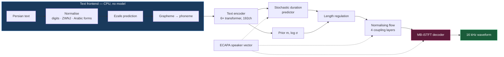
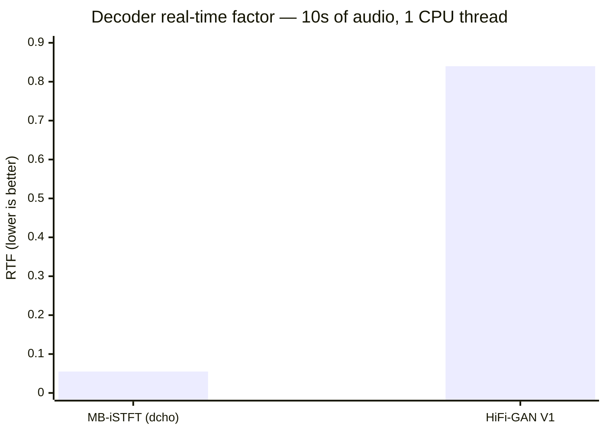
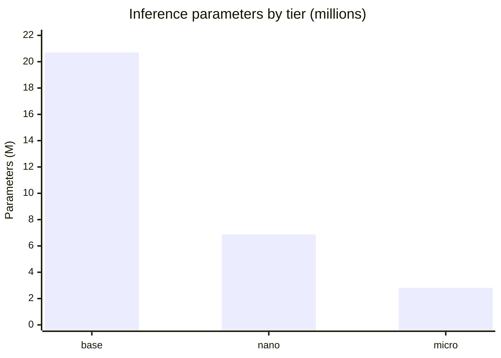
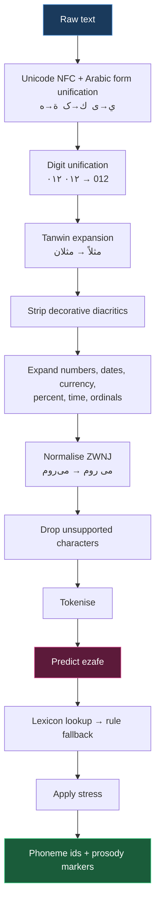
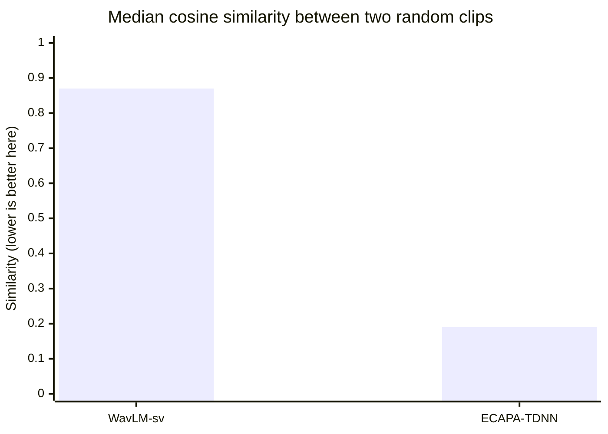

<div align="center">


# dcho

**Persian text-to-speech, built to run in real time on a CPU**

[](LICENSE)
[](pyproject.toml)
[](tests/)
[](#the-corpus)

**English** · [فارسی](README.fa.md)

</div>

---

> **Status: pre-training.** The model, the Persian text frontend, the data
> pipeline and the training loop are implemented and verified. The corpus
> has been audited and prepared. **No trained checkpoint exists yet.**
> Every number in this document is measured, not projected — but the
> numbers are about architecture and data, not about synthesis quality,
> which cannot be reported until training has run.

---

## Contents

- [The idea](#the-idea)
- [Architecture](#architecture)
- [Measured performance](#measured-performance)
- [The Persian text frontend](#the-persian-text-frontend)
- [The corpus](#the-corpus)
- [Speaker discovery](#speaker-discovery)
- [Cost engineering](#cost-engineering)
- [Project layout](#project-layout)
- [Usage](#usage)
- [Roadmap](#roadmap)
- [License and attribution](#license-and-attribution)

---

## The idea

One claim shapes every decision in this project:

> **In Persian text-to-speech, output quality depends far more on data
> quality and on the correctness of the text frontend than on the size of
> the acoustic model.**

The reasoning is simple. An acoustic model has a narrow job: turn a
sequence of phonemes into a waveform. If the incoming phoneme sequence is
wrong — if کرم is read *kerm* where the sentence means *karam*, or if the
ezafe linker in کتابِ من is dropped — no amount of extra parameters
repairs it. The model renders the wrong thing faithfully.

Three consequences follow, and they are the spine of this repository.

**The budget belongs in the text frontend and in data cleaning, not in
model size.** Both are close to free, because both run on a CPU.

**Running on a CPU costs almost nothing in quality.** What makes a model
slow on a CPU — the transposed-convolution stack in the vocoder — is not
what makes it good. Replace it with an inverse STFT and almost all of the
quality stays. This is measured below: **15.25× faster, 3.93× smaller.**

**Most expensive training reruns are caused by bugs that a CPU can find in
seconds.** Wrong phonemisation, mismatched transcripts, a bad config. None
of them need a full training run to discover. Building the cheap detectors
first is what keeps the project's total cost in the low hundreds of dollars
rather than the low thousands.

---

## Architecture

`dcho` is a single-stage, non-autoregressive model: a conditional VAE whose
prior is conditioned on phonemes through a normalising flow, with a
multi-band iSTFT decoder and adversarial training. It descends from VITS2,
with the decoder replaced.

Single-stage matters for quality as much as for speed. A separate acoustic
model and vocoder are trained against different objectives and meet at an
intermediate representation neither of them owns; the mismatch is audible
as the metallic ring two-stage systems are known for. Here the decoder is
trained on exactly the latents it will be handed at inference.



### Why the decoder is the whole story

In a conventional VITS, the vocoder reaches the output sample rate purely
through transposed convolutions. At 16 kHz with hop 256 that is an
upsampling chain of `[8, 8, 2, 2]`, and on a CPU it dominates everything
else the model does.

The multi-band iSTFT decoder upsamples by only 16× in the network. It then
predicts a short-time magnitude and phase for each of four frequency
subbands; an inverse STFT turns those into subband waveforms, and a
pseudo-QMF bank merges them. The remaining upsampling is done by two
parameter-free linear operations instead of by convolution.

```
network upsampling      4 × 4 = 16
inverse STFT hop                4
PQMF subbands                   4
                       ────────────
total                         256   = hop_length ✓
```

That identity is asserted in the test suite for every configuration,
because getting it wrong produces audio at the wrong rate with no error
message.

Both parameter-free stages were measured for fidelity rather than assumed:

| Stage | Reconstruction error |
|---|---|
| PQMF analysis → synthesis | **−58.5 dB** |
| Inverse STFT round trip | **−142 dB** (float32 precision floor) |

### Components

| Component | Configuration | Present at inference |
|---|---|---|
| Text encoder | 6 transformer blocks, 192ch, 2 heads, relative position | yes |
| Duration predictor | stochastic, flow-based, with adversarial critic | yes |
| Normalising flow | 4 coupling layers, transformer in the first | yes |
| Decoder | MB-iSTFT, 4 subbands, n_fft 16, hop 4 | yes |
| Posterior encoder | 16-layer WaveNet over the linear spectrogram | **no** |
| Discriminators | multi-period (2,3,5,7,11) + multi-resolution + duration | **no** |

The posterior encoder and every discriminator are dropped at export. They
are roughly a third of the parameters and none of the inference cost.

Rhythm deserves a note. A duration predictor that regresses one value per
phoneme converges on the conditional mean, and the conditional mean of a
duration distribution is a monotone that listeners hear immediately as
robotic. The stochastic predictor learns the full conditional distribution
with a normalising flow and samples from it, so two phonemes in identical
contexts can receive different durations — which is what real speakers do.

---

## Measured performance

All figures are PyTorch float32 on x86 CPU. ONNX with selective int8
quantisation is expected to improve on these; that step is implemented but
cannot be measured until a trained checkpoint exists.

### Decoder cost, same output rate



| Decoder | Parameters | RTF @ 1 thread | RTF @ 4 threads |
|---|---|---|---|
| **MB-iSTFT (dcho)** | **3.68 M** | **0.055** | **0.017** |
| HiFi-GAN V1 | 14.46 M | 0.840 | 0.244 |
| **Ratio** | **3.93× smaller** | **15.25× faster** | **14.03× faster** |

Both decoders were built at the same input width and the same output rate
and timed on the same machine. Reproduce with
`python tests/test_decoder_cost.py`.

Across the whole model the decoder choice is worth **7.5×**:

| | RTF @ 1 thread |
|---|---|
| `dcho-base` as built | **0.1204** |
| ├─ MB-iSTFT decoder | 0.0551 |
| └─ encoder, flow, duration | 0.0653 |
| Same model with a HiFi-GAN decoder | 0.9052 |

### Model sizes



| Tier | Total params | Inference params | Decoder | RTF @ 1 thread | RTF @ 4 threads |
|---|---|---|---|---|---|
| `base` | 29.53 M | 20.70 M | 3.69 M | 0.120 | 0.061 |
| `nano` | 10.91 M | 6.87 M | 1.09 M | 0.056 | 0.035 |
| `micro` | 5.06 M | 2.82 M | 0.39 M | — | — |

`micro` is not a shipping model. It is the cheap probe used to compare
configuration choices before committing GPU hours — roughly 1.5 hours and
$1.50 per experiment. `nano` is produced by distillation from `base`, not
by training from scratch.

---

## The Persian text frontend

This is where a Persian TTS system is won or lost, and it costs nothing at
inference.

### The problem

Persian script does not write short vowels. The mapping from spelling to
pronunciation is therefore not one-to-one, and in many cases cannot be
resolved without knowing what the sentence means.

**Short vowels.** کرم is *karam* (generosity), *kerm* (worm), *kerem*
(cream) or *korom* (chromium). All four are spelled identically.

**Ezafe.** More consequential, because it is far more frequent. In
«کتاب من روی میز است» the word کتاب is pronounced *ketāb-**e***. That
linker is not written, and dropping it both breaks the syntax and sounds
immediately artificial. In running Persian, roughly 15–20% of words carry
it. Predicting it requires syntactic analysis, not dictionary lookup.

**Stress.** Persian stress is word-final by default, with exceptions
frequent enough that ignoring them sounds mechanical. Verb prefixes take
the stress: می‌رَوَم is *MI-ravam*, not *mi-ra-VAM*. Negation نـ takes it too.

### The pipeline



The phoneme inventory is deliberately small — 23 consonants, 6 vowels, and
6 suprasegmental markers. A compact symbol set keeps the embedding table
small and lets every symbol be seen often enough to be learned well.

### The golden set — the project's cheapest quality gate

`tests/golden/golden.tsv` holds **231 Persian sentences with hand-checked
phonemisation**, across ten categories: ezafe, homographs, stress, numbers,
ZWNJ, Arabic loanwords, foreign loanwords, punctuation, proper nouns and
running text.

Every frontend change is scored against it **in about two seconds, on a
CPU, at zero cost**. Without it, the only way to discover that ezafe is
being emitted wrongly is to train a full model and listen — a fifty-dollar,
five-day way to find a text bug.

It earns its keep. The first run against the golden set exposed a
systematic error in exactly two seconds:

| Input | Expected | Produced |
|---|---|---|
| خانه‌ی من | `xAn1ey-` | `xAn1eyi-` |
| صدای موسیقی | `sed1Ay-` | `sed1Ayi-` |
| خانهٔ پدر | `xAn1ey-` | `xAn1e-` |

When ezafe is written out, that trailing ی **is the linker**, not part of
the stem — the code was reading it as the indefinite marker, which is a
different word. After the vowel, the /y/ glide was missing entirely. One
fix, both directions:

```mermaid
xychart-beta
    title "Golden-set exact match, before and after the ezafe fix"
    x-axis ["overall", "ezafe", "stress", "zwnj"]
    y-axis "Exact match (%)" 0 --> 100
    bar [77.5, 80.0, 84.6, 94.1]
    bar [84.0, 97.5, 92.3, 100.0]
```



### Current accuracy

| Category | Rows | Exact match |
|---|---|---|
| zwnj | 17 | **100.0%** |
| ezafe | 40 | **97.5%** |
| foreign | 16 | 93.8% |
| names | 16 | 93.8% |
| stress | 26 | 92.3% |
| general | 15 | 86.7% |
| punctuation | 21 | 85.7% |
| numbers | 27 | 81.5% |
| homograph | 31 | 67.7% |
| arabic | 22 | 45.5% |
| **Overall** | **231** | **84.0%** |

Ezafe scored on its own: **precision 92.3%, recall 97.8%, F1 95.0%.**

The two weak categories are weak for a reason that no rule set can fix.
Homographs need sentence context to disambiguate; Arabic loanwords follow
a partly lexical, partly morphological system. Both are the job of the
learned grapheme-to-phoneme model on the roadmap. The rule-based layer
exists so that acoustic training can start without waiting for it.

The current numbers are recorded as regression floors in
`tests/test_g2p.py`. Raise them when the frontend improves; never lower
them to make a change pass.

---

## The corpus

[`Thomcles/Persian-Farsi-Speech`](https://huggingface.co/datasets/Thomcles/Persian-Farsi-Speech),
CC-BY-4.0. Audited in full: 109,401 rows in 9 minutes 24 seconds, for
**half a cent**.

| Property | Measured |
|---|---|
| Clips | 109,401 |
| **Total audio** | **417.5 hours** |
| Sample rate | 16 kHz, **all** clips |
| Format | WAV, **all** clips |
| Unreadable audio | **0** |
| Empty transcripts | **0** |
| Duplicate transcripts | 408 (0.4%) |
| Transcripts containing digits | 14,786 (13.5%) |
| Transcripts containing Latin | 3,548 (3.2%) |
| Transcripts containing ZWNJ | 66,613 (60.9%) |
| Distinct characters | 191 |
| Median quality (`mos_ovr`) | 3.51, minimum exactly 3.00 |

Technically the corpus is in good shape. The interesting finding is the
duration distribution.

### Duration is strongly bimodal

```
   4-5s    1,268  █
   5-6s    3,702  ████
   6-8s   19,137  ████████████████████████
  8-10s   42,610  ███████████████████████████████████████████████████████
 10-12s   13,781  █████████████████
 12-15s      365
 15-20s      241
 20-25s    1,125  █
 25-30s   22,386  ████████████████████████████
 30-40s    4,553  ██████
```

Two disjoint clusters — about 80,000 clips between 4 and 12 seconds, and
about 28,000 between 20 and 40 — separated by an almost empty valley. The
median is 9.5 s while the 75th percentile is 24.3 s, so quoting a mean of
13.7 s would describe a clip that does not exist anywhere in the corpus.

Thirty-second utterances are hostile to this kind of training: the
posterior encoder and the flow run over the full length, and alignment
locks in far more slowly and less reliably on long inputs. **Version one
excludes everything above 13 seconds.** That costs 220 hours and leaves
184 — for scale, the reference corpus the original VITS was trained on is
24 hours.

### Training tiers

| Split | Filter | Clips | Hours | Speakers |
|---|---|---|---|---|
| `tier_a_train` | mos ≥ 3.6, 1–12 s, normal speech rate | 25,654 | **65.3** | 1,401 |
| `tier_b_train` | mos ≥ 3.0, 0.8–13 s, normal speech rate | 75,766 | **180.8** | 2,410 |
| `eval` | held out entirely | 536 | 1.4 | 25 |
| excluded | above 13 s | 28,305 | ~220 | — |

The evaluation split is **speaker-disjoint**: its 25 clusters appear nowhere
in training, verified by an assertion in `jobs/build_manifest.py`. A random
split would score the model on voices it had already memorised, flattering
it in exactly the dimension a multi-speaker system most needs measured.

The speech-rate window (5.45–12.38 Persian letters per second) was derived
from the data, not assumed. It costs nothing to compute and flags 4,375
clips whose text is far too long or too short for their duration — the
strongest free signal for transcript mismatch there is.

### Transcript verification, and why it was deferred

A nine-cent smoke test over 51 clips with `whisper-large-v3-turbo` produced
a character-error distribution with a median of 0.149 and a 95th percentile
of 0.346. For clean audio that median looks less like "15% of transcripts
are wrong" and more like the ASR's own floor on colloquial Persian — which
would put the useful cut around 0.30 (discarding 7.8%) rather than 0.15
(discarding 49%).

The decisive number was throughput, not accuracy: **2.3× real time**,
because Whisper pads every clip to thirty seconds regardless of length and
decodes autoregressively.

| Run | Projected cost |
|---|---|
| 3,000-clip sample | **$5.33** |
| Full 109,401 clips | **$194** |

The full pass costs more than the entire project budget. The stage is
deferred, and the free speech-rate window carries the filtering in the
meantime. When it does run it should use a CTC model such as wav2vec2 —
non-autoregressive, no thirty-second padding, roughly two orders of
magnitude faster.

Nine cents bought an informed five-dollar decision.

### Two findings that changed the plan

**The audio is WAV, so decoding is free.** The design originally included
a feature-precomputation stage to avoid repeatedly decoding audio. WAV is
uncompressed: that "decoding" is a header parse and a memory copy. The cost
the stage existed to remove was never there. **The stage was deleted** —
saving about $4, several hours, and 30 GB of storage.

**The register is partly colloquial.** The most frequent duplicate
transcripts are podcast sponsor spots, and spoken forms appear in the text
(«رو» for «را»). Part of the corpus is conversational rather than read
prose. Not a defect, but it has to be managed knowingly, because the golden
set is written in formal register.

---

## Speaker discovery

The corpus carries no speaker labels. They had to be recovered from audio
before anything speaker-conditioned could be trained. The path there is
worth recording, because the first attempt produced a confident-looking
result that was wrong.

### A negative result, and how it was caught

The first run used `microsoft/wavlm-base-plus-sv`. All 109,401 clips
embedded in 19 minutes, clustering completed, a report was produced. Three
measurements said the output was useless:

| Diagnostic | WavLM | ECAPA-TDNN | What it means |
|---|---|---|---|
| Mean cosine to the global centroid | 0.917 | **0.468** | near 1.0 means every embedding points the same way |
| Dimensions carrying 90% of variance | 14 / 512 | **107 / 192** | a 512-d embedding using 14 has collapsed |
| Median similarity of random pairs | 0.870 | **0.190** | should sit far below the same-speaker threshold |



The decisive test used a signal the encoder never saw: **speech rate**.
Speech rate is a strong, stable speaker trait, so a genuine speaker group
must be markedly tighter in it than the corpus as a whole. WavLM's densest
neighbourhood was **6%** tighter. It was not a speaker — most likely a
recording condition.

`speechbrain/spkrec-ecapa-voxceleb` was adopted instead, which is what the
design document had specified before it was substituted for convenience.
The control that settled it — between-cluster over within-cluster variance
of speech rate:

| Labels | Variance ratio |
|---|---|
| Real clusters | **0.4670** |
| Same labels, randomly shuffled | 0.0049 |
| **Ratio** | **95× better than chance** |

### Result

**2,728 clusters**, at a distance threshold of 0.366 derived from the 97th
percentile of the observed pair-similarity distribution — not from any
paper's default. The distribution is heavily skewed:

| Clusters with at least | Count | Corpus covered |
|---|---|---|
| 10 clips | 978 | 94.9% |
| 50 clips | 362 | 82.6% |
| 100 clips | 210 | 73.0% |

Median cluster size is 5 clips and 512 clusters are singletons. The corpus
has a head of two to three hundred substantial voices and a long tail.

### What that decides

The model supports two ways to condition on a voice, and the measurement
chose between them.

A **lookup table over cluster ids** is the conventional choice and is
better when clusters are clean and well populated. With a median of 5 clips
per cluster, most entries would never see enough data to estimate a usable
vector.

A **linear projection from the continuous ECAPA vector** is what ships. It
only requires the embedding to carry voice information, not to be cleanly
separable; it uses all 417 hours; and it generalises to a voice never seen
in training. Cluster ids are kept for selecting the flagship voice and for
keeping the evaluation split speaker-disjoint.

### Two lessons now enforced in code

The clustering threshold sweep is **derived from the observed similarity
distribution** rather than hardcoded. WavLM puts random pairs near 0.87 and
ECAPA near 0.19; any fixed range is meaningful for one and noise for the
other.

`separation_report()` is now a permanent part of the job. No embedding is
accepted without those four diagnostics, because an encoder can look
perfectly healthy — finite, unsaturated, normalised — and still be useless
on a particular corpus.

---

## Cost engineering

The expensive failure in a project like this is not a crash. A crash is
free; it stops. The expensive failure is the pattern where a full training
run completes, the output is wrong, something is changed, and it runs again
from the start. Ten iterations, ten times the cost.

The key observation is that **most of those iterations are not caused by
model bugs**. They are caused by wrong phonemisation, mismatched
transcripts, bad configuration, or a run that diverged in the first hour
and was allowed to continue. None of those need a full run to be found.

| Class of bug | Without the cheap detector | With it |
|---|---|---|
| Wrong phonemisation | full run — $89, 5 days | seconds — **$0** |
| Mismatched transcripts | full run — $89, 5 days | once, up front — **$2** |
| Broken loss or data path | full run — $89, 5 days | 10 minutes — **$0.15** |
| Poor configuration | full run — $89, 5 days | 90 minutes — **$1.50** |
| Diverged training | runs to completion — $89 | auto-stop — **$2** |

Seven mechanisms implement this, described in full in
[`docs/DESIGN.fa.md`](docs/DESIGN.fa.md) §10. Two matter most.

**The golden set** turns every phonemisation bug into a two-second CPU
test. **The micro configuration** turns every architecture experiment into
a 90-minute, $1.50 run instead of a five-day, $89 one — so ten experiments
cost about $15 rather than about $1,000.

Two are hard constraints in code rather than intentions:

```python
# dcho/train/guards.py — the run ends itself
BudgetGuard(hourly_rate_usd=0.80, max_cost_usd=25.0)   # exits at the ceiling
HealthGuard({                                          # exits on a dead run
    "alignment_entropy_max_at_step": {"step": 20000, "value": 0.35},
    "disc_loss_min": 0.05,
})
```

Alignment entropy is the first guard to fire because it is the earliest
reliable signal that a text-to-speech run will work at all. A halted run
still writes a checkpoint — the weights up to the stop are often worth
inspecting, and discarding them would mean paying for the same steps twice.

### Actual spend so far

Nine jobs, including three failures:

| Job | Result | Billed | Cost |
|---|---|---|---|
| Audit smoke test | ok | 0.2 min | $0.0001 |
| **Full corpus audit** | ok | 9.4 min | $0.0047 |
| Speaker smoke test | volume mount failed | 1.6 min | $0.0210 |
| Retry | dtype bug found | 0.9 min | $0.0120 |
| Retry | ok | 1.0 min | $0.0127 |
| Full WavLM run | **negative result** | 23.9 min | $0.3185 |
| ECAPA diagnostic | ok | 1.9 min | $0.0252 |
| **Full ECAPA discovery** | ok | 18.1 min | $0.2408 |
| | | **Total** | **$0.659** |

The $0.32 spent on WavLM bought a negative result — but a *knowable* one.
Without it, the multi-speaker model would have trained on meaningless
labels, voices would have averaged together, and nobody would have found
out until the end.

Full project projection: **$149 central estimate, $200 hard ceiling**, with
a decision point at **$30** where a complete, measured model exists and
continuing becomes a choice rather than a commitment.

---

## Project layout

```
dcho/
├── dcho/
│   ├── text/            normaliser, numbers, lexicon, rules, ezafe, G2P
│   ├── model/           architecture, PQMF, iSTFT, alignment, losses
│   ├── data/            streaming dataset and collation
│   ├── train/           training loop, budget and health guards
│   ├── export/          ONNX export, selective quantisation
│   ├── infer/           runtime — onnxruntime only, no torch
│   ├── eval/            automatic scorecards
│   └── cli.py
├── jobs/                scripts that run on Hugging Face infrastructure
│   ├── submit.py        submission harness with cost reporting
│   ├── audit.py         corpus audit
│   ├── speakers.py      speaker discovery with separation diagnostics
│   └── verify.py        transcript verification by ASR round-trip
├── configs/             base · nano · micro
├── tests/
│   └── golden/          231 hand-checked phonemisations
└── docs/DESIGN.fa.md    full technical design document
```

---

## Usage

> Requires a trained checkpoint, which does not exist yet. The interfaces
> below are implemented and are what the first release will expose.

```python
from dcho import TTS

tts = TTS.from_pretrained("Dibachain/dcho-tts-fa-base", quantized=True)

tts.say("سلام، حال شما چطور است؟", out="salam.wav")

audio = tts("متن نمونه", speaker=0, speed=1.1)

for chunk in tts.stream(long_text):    # constant time to first audio
    player.write(chunk)
```

```bash
dcho say "سلام دنیا" -o out.wav
dcho phonemize "کتاب من" --ipa      # ket1Ab- m1an  →  ketɒ̍ːb‿e mæ̍n
dcho normalize "او ۲۵ سال دارد."    # او بیست و پنج سال دارد.
dcho bench --threads 1 2 4
```

The runtime depends on `onnxruntime` and `numpy` and deliberately not on
torch — an install of roughly 50 MB rather than two gigabytes.

Long text is split at punctuation and synthesised chunk by chunk, each
yielded as soon as it is ready. Time to first audio then stops growing with
input length: a paragraph starts speaking as quickly as a sentence does.
Total synthesis time is unchanged; perceived latency is not.

### Development

```bash
git clone git@github.com:AliAkrami1375/dcho.git && cd dcho
pip install -e ".[train]"
python -m unittest discover -s tests          # 129 tests
python tests/test_decoder_cost.py             # reproduce the decoder benchmark
```

---

## Roadmap

- [x] Model architecture, verified structurally on CPU
- [x] Persian text frontend with rule-based G2P and a 5,862-entry lexicon
- [x] Golden set and the regression gate around it
- [x] Corpus audit — 417.5 hours characterised
- [x] Speaker discovery — 2,728 clusters, validated at 95× chance
- [x] Training loop with budget and health guards
- [ ] Transcript verification by ASR round-trip *(deferred — see below)*
- [ ] Micro-configuration experiments
- [ ] Phase 1 — alignment bootstrap on `tier-A`
- [ ] Phase 2 — main training on `tier-B`
- [ ] Phase 3 — quality fine-tune, Phase 4 — flagship voice
- [ ] ONNX export with selective int8 quantisation
- [ ] Learned G2P model (`dcho-g2p-fa`) for homographs and Arabic loanwords
- [ ] `nano` by distillation
- [ ] Interactive demo

### Targets

| Metric | Target | Status |
|---|---|---|
| Character error rate, ASR round-trip | < 5% | pending training |
| Predicted MOS (UTMOS) | ≥ 3.8 | pending training |
| Ezafe accuracy | ≥ 95% | **97.5% on the golden set** |
| RTF, 1 CPU core, int8 | ≤ 0.10 | 0.120 in fp32, pre-quantisation |
| Model size, int8 | ≤ 35 MB | 20.7 M inference parameters |
| Time to first audio, streaming | ≤ 200 ms | implemented |

---

## License and attribution

Apache-2.0. See [LICENSE](LICENSE).

The corpus is [`Thomcles/Persian-Farsi-Speech`](https://huggingface.co/datasets/Thomcles/Persian-Farsi-Speech),
distributed under CC-BY-4.0 and used under those terms.

The architecture builds on the VITS and VITS2 line of work, on the
multi-band iSTFT decoder of MB-iSTFT-VITS, and on HiFi-GAN's discriminator
design. Speaker embeddings come from SpeechBrain's ECAPA-TDNN.

---

<div align="center">

**[Full technical design document (Persian)](docs/DESIGN.fa.md)**

</div>
